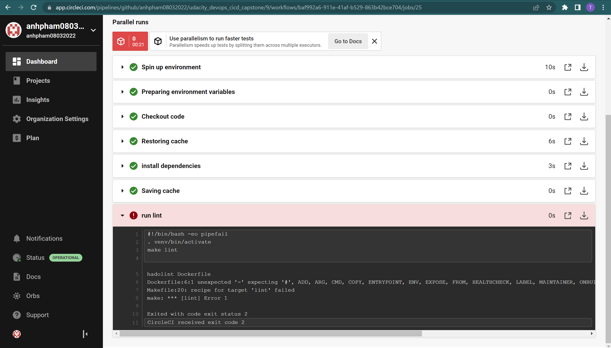
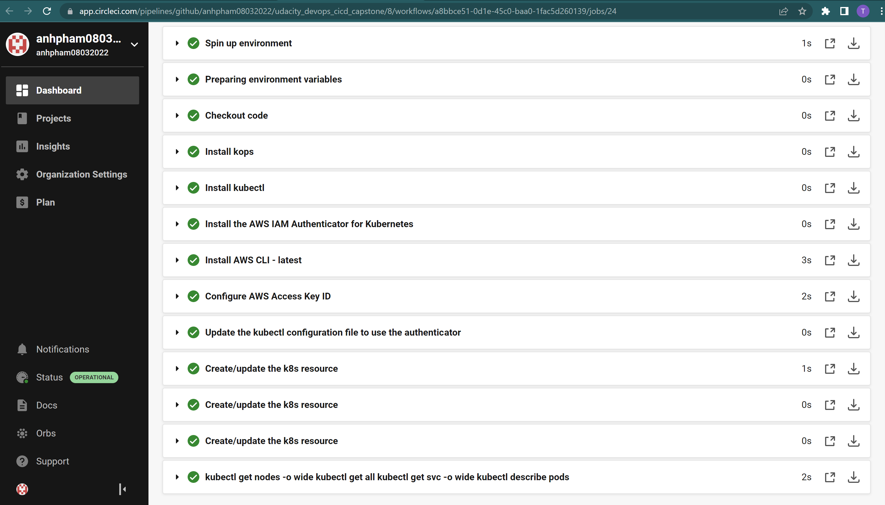
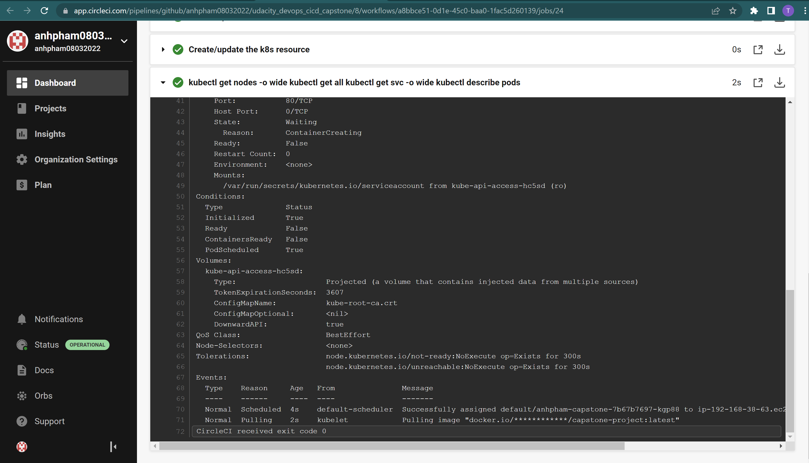

## The project information: This project based on my project from section 4 but deploy the app into AWS EKS instead of running in local machine. Most of the information I used to do this project in this link: https://circleci.com/developer/orbs/orb/circleci/aws-eks

## Set Up Pipeline
1. Execute linting step in code pipeline: 

* Lint passed:

* Lint failed:

* Pipeline run successfully: 

## Build Docker Container

## Successful Deployment  

1. Deployment successfully: 

2. Get nodes, pods, services:

3. Cloud formation:

4. EKS cluster:

5. Run application:

